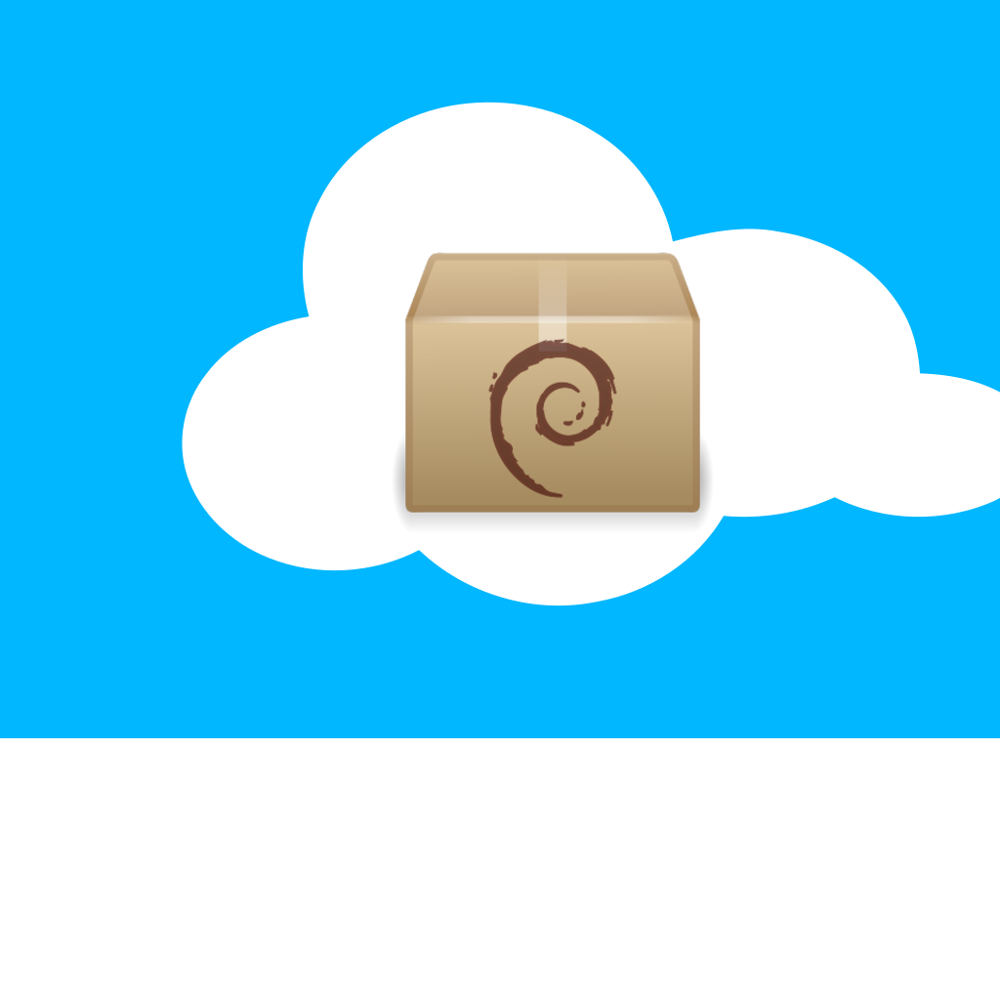

<h1 align="center">debnet</h1>

A simple utility to automatically install .deb packages from urls
---

**usage**: debnet \[-h] \[--no-delete] \[--no-update] URL \[URL ...]

Downloads and installs deb files from the provided urls

positional arguments:

  URL          an http(s) url

optional arguments:

  -h, --help   show this help message and exit

  --no-delete  Don't delete the deb file after installation

  --no-update  Skip apt-get update

You may use `man debnet` after installation

## Installation

Run 
* `sudo make install` to install
* `sudo make uninstall` to remove
* `sudo make update` to update

